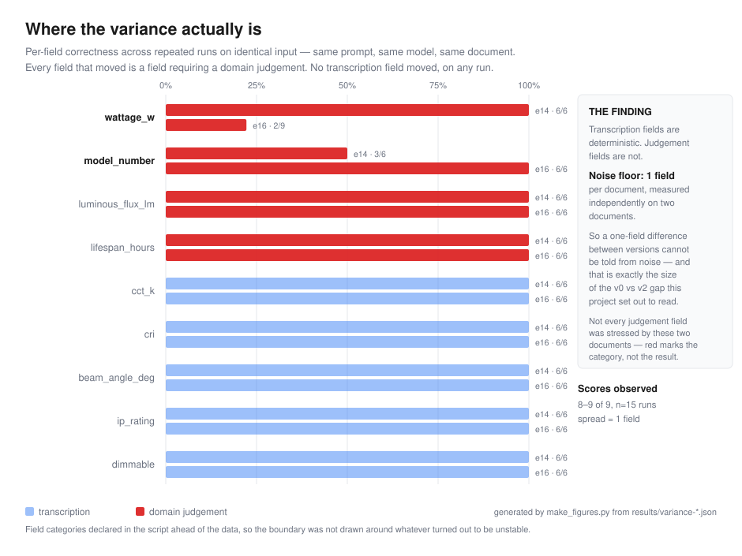

# Clause — lighting datasheet extraction

Extracts nine structured fields from lighting product datasheets, with an
evaluation harness that measures whether the extraction is actually correct.

**Live:** https://clause-9kq9.onrender.com/docs
*Free tier — the first request after ~15 minutes idle takes about 50 seconds to wake.*

| | v2 (current) |
|---|---|
| Field accuracy | **99.4%** — 161/162 |
| Expected score | **160.7 ± 0.7** — see [measured variance](#the-system-is-not-deterministic-and-it-was-measured) |
| Fully correct documents | 17/18 |
| Documents in eval set | 18 |
| Cost per document | $0.000465 (list price; run on a free tier) |
| Median latency | 19.8 s |
| Total spend to date | **$0.00** |

**99.4% is one sample from a distribution, not a property of the system.** The
run-to-run noise floor was measured at **1 field per document**, so a
one-field difference between two versions of this system cannot be
distinguished from noise. That measurement is in
[`results/variance-*.json`](results/) and the score above was
[predicted before the run](PREDICTION.md).

Ground truth is hand-written against the source documents by someone who works
in the lighting industry. **10 of 18 cases were labelled unassisted; 8 were
labelled with assistance and verified field by field against the document.**
The domain decisions behind all 18 are mine and are documented in
[`schema.py`](schema.py).

---

## The problem

A lighting datasheet states a product's electrical and photometric performance.
Specifiers, wholesalers and contractors pull those figures out by hand, one PDF
at a time, to build quotation schedules and compare products.

The task looks like simple transcription. It isn't, because datasheets
routinely print **several numbers that could plausibly answer the same
question**:

- **System wattage** (total draw including driver losses) and **LED load**
  (the module alone) both appear, often within two lines of each other
- **Efficacy** in lm/W sits next to both wattage and lumen output, and looks
  like it belongs to one of them
- **Warranty hours** are frequently printed more prominently than **L80/B10
  rated life**, and the two differ by a factor of two or more
- **Luminaire flux** (light leaving the fitting) and **LED module flux** (light
  produced before optical losses) are both quoted

Picking the wrong one is not a rounding error. Specify LED load instead of
system wattage and the circuit is undersized. Quote warranty hours as rated
life and the maintenance schedule is wrong.

**Knowing which figure is correct is domain knowledge, not a parsing problem.**

## Who would pay for this

Lighting wholesalers and specifiers processing supplier datasheets into
quotation systems; manufacturers normalising competitor data; anyone
maintaining a product database sourced from hundreds of PDFs in a hundred
different layouts.

## Why AI rather than a parser

Every manufacturer formats differently. There is no consistent label, ordering,
or table structure. A rules-based parser needs a new rule per supplier and
breaks whenever a template changes. A language model reads the document the way
a person does — which is why the disambiguation problem above is the real work,
not the parsing.

---

## The nine fields

| Field | Type | Notes |
|---|---|---|
| `model_number` | string | Full order code where present, else the model name |
| `wattage_w` | number | **System** wattage, including driver losses |
| `luminous_flux_lm` | number | **Luminaire** output, not bare LED module output |
| `cct_k` | number | Correlated colour temperature, kelvin |
| `cri` | number | Colour rendering index |
| `beam_angle_deg` | number | Degrees |
| `ip_rating` | string | Code as printed, e.g. `IP65` |
| `lifespan_hours` | number | **L80/B10 rated life**, not warranty |
| `dimmable` | boolean | `null` if the document does not mention it |

Conventions: numbers bare, no units, no thousands separators. Units live in the
field name. Absent values are `null` — never `"N/A"` or an empty string.

## Schema decisions

These are the judgement calls. They are documented in `schema.py`, stated
verbatim in the extraction prompt, and applied identically in the ground truth.
They are the difference between a working extractor and a plausible-looking one.

| Decision | Rule | Why |
|---|---|---|
| `wattage_w` | System, not LED load | System wattage is what the circuit must carry |
| `luminous_flux_lm` | Luminaire, not module | Module flux ignores optical losses; it is not what reaches the space |
| `lifespan_hours` | L80/B10 rated life, not warranty | Warranty is a commercial term; rated life is a performance figure |
| `model_number` | Order code preferred over model name | The order code is what gets purchased |

**Deliberately deferred:** `dimming_protocol` (DALI / 0-10V / TRIAC). Adding a
field mid-cycle invalidates every ground-truth file already written and breaks
version comparison. It is scheduled for a version boundary, not a convenient
moment.

---

## Architecture

```
    datasheet text
          │
          ▼
    ┌──────────────┐        ┌────────────┐
    │  extract.py  │◄───────│ schema.py  │  9 fields + domain rules
    │              │        └────────────┘
    │  · prompt carries the disambiguation rules
    │  · Gemini structured output (native JSON schema)
    │  · Pydantic validation
    │  · retry ×3, feeding the validation error back
    │  · times, counts tokens, computes cost
    └──────┬───────┘
           │
           ├──────────────► requests.jsonl   every call: latency, tokens, cost
           │
           ├──────────────► api.py           POST /extract · GET /health
           │
           ▼
    ┌──────────────┐        ┌───────────────────────┐
    │ evaluate.py  │◄───────│ evals/ground_truth/   │  hand-written
    └──────┬───────┘        └───────────────────────┘
           │
           ▼
    results/v0.jsonl · results/failures.json
```

**Stack:** Python · Pydantic · FastAPI · Google Gemini · Docker · Render

---

## Evaluation methodology

**The answer key is validated before it is allowed to score anything.** Three
separate times this harness reported a failure that was a defect in the ground
truth rather than in the system. After the third, the fix stopped being "be more
careful" and became structural: `evaluate.py` refuses to score any case whose
ground truth contains a placeholder, a missing key, an unknown key, or a
wrongly-typed value.

**Absent is not null.** A key missing from a ground-truth file means *I forgot
to write this*. A key set to `null` means *the document genuinely does not state
this*. Reading the first as the second silently converts an omission into an
assertion — and marks the model wrong for being right.

**Scoring is strict.** A datasheet value is right or it is not; there is no
"nearly 4940 lumens". Numerics compare as numbers so `185` and `185.0` match.
`ip_rating` is case-insensitive because IP codes are standardised;
`model_number` is **case-sensitive**, because the OCR rule below requires
verbatim preservation and case is therefore data, not formatting.

**One scoring function, one home.** `values_match` lives in `schema.py` and is
imported everywhere. Two scripts scoring the same data with two helpers is how
you get two numbers for one run — which happened, on Day 17.

**A run's filename states the shape of the run.** `results/v2.jsonl` is a full
baseline. `v2-only-e16.jsonl` is one case. `v2-INCOMPLETE.jsonl` had a document
produce no valid output. This exists because a subset run once overwrote an
18-document baseline while printing *"not a baseline"* to the terminal — a
warning that does not change behaviour is decoration.

### The eval set

18 synthetic datasheets, 162 field judgements. Baseline cases exist so failures
can be localised: if a baseline case fails, the pipeline is broken; if only a
trapped case fails, the disambiguation is broken.

| Case | Type | Contains |
|---|---|---|
| `e01` | Hard | Efficacy figure, system wattage *and* LED load, warranty *and* rated life, luminaire *and* module flux |
| `e02`, `e03` | Baseline | Single variant, every value stated once |
| `e04`–`e12` | Mixed | Varying layout, partial data, absent fields |
| `e11` | Hard | Revision note superseding figures on the same page |
| `e13`–`e18` | Hard | Patterns the domain rules were *not* written for |
| `e14` | Hard | OCR-damaged order code (`l` for `1`, `O` for `0`) |
| `e16` | Hard | Two footnotes, one relabelling a value and one conditioning it on unstated context |

---

## Results

**v2 — 161/162 field judgements, 17/18 documents fully correct.**

The single failure is `e16` `wattage_w`: the model returned `200`, the value
printed in the table; ground truth is `185`, from a footnote stating that units
supplied after January 2026 draw 185 W.

### The score was predicted before the run

[`PREDICTION.md`](PREDICTION.md) was committed before this baseline was
generated. It predicted **160.7 ± 0.7**, gave the probability of each of the
four possible outcomes, named which two documents would fail and with what
values, and stated in advance what result would falsify the model.

| | Predicted | Observed |
|---|---|---|
| Score | 160.7 ± 0.7 (160 or 161 at 90%) | **161** |
| `e16` `wattage_w` | wrong, returns `200` — 75% likely | **wrong, returned `200`** |
| `e14` `model_number` | wrong — 60% likely | correct (the 40% branch) |
| Any third document failing | would falsify the variance claim | **none failed** |

The prediction held, and the falsification condition did not trigger.

### The system is not deterministic, and it was measured

Identical input, identical prompt, identical model, repeated runs:



| Document | Observations | Field that moves | Correct rate |
|---|---|---|---|
| `e16` | 9 | `wattage_w` | 2/9 |
| `e14` | 6 | `model_number` | 3/6 |

**Every other field returned the same value on every run.** The instability is
confined to fields where extraction requires a domain judgement rather than
transcription — and the judgement/transcription split is declared in
`make_figures.py` *ahead of the data*, so the boundary was not drawn around
whatever turned out to be unstable.

Two consequences, both of which constrain what this project may claim:

1. **The noise floor is 1 field per document.** v0 scored 161/162 and v2 scored
   161/162. That difference is zero fields against a noise floor of one, so no
   claim is made about the footnote rule's effect on aggregate accuracy. The
   comparison is not "no effect" — it is **unmeasured**, and detecting a
   one-field difference would need far more runs than a 20-request daily quota
   allows.
2. **Majority voting would make `e16` worse.** Voting reduces variance *around*
   the model's central tendency; it does not move it. `e16` returns the wrong
   value in 7 of 9 runs, so a majority vote returns the wrong value reliably
   instead of the right one occasionally.

### What the footnote rule does and does not do

`e16` carries two footnotes and the same rule handles them differently, at n=5
consecutive runs:

| Footnote | What it does | Applied |
|---|---|---|
| *"Rated life figure is L70/B50. The corresponding L80/B10 figure is 70 kh."* | **Relabels** a value against a criterion the rules already name | **5/5** |
| *"...units supplied after January 2026 draw 185 W. The value in the table applies to pre-2026 stock."* | **Conditions** a value on context the document never resolves | **0/5** |

The rule works where the footnote supplies a label the rules already ask for,
and fails where it requires the reader to supply a missing premise. That is a
gap in the *document*, not in the prompt, and no prompt rule closes it.

### Three components built, measured, and removed

Each was implemented, measured against the eval set, and rejected on the
numbers. The code is retained with the verdict recorded at the top of the file.

| Component | Measurement | Verdict |
|---|---|---|
| **Citations** — quote the source line for each value | `e02` 9/9 fields, 9/9 citations verified. `e01` **9/9 → 1/9 fields** | Opt-in, default off. Asking for evidence and extraction together degrades extraction on hard documents |
| **Retrieval** — per-field queries over a local vector index | Context **+24.7%**, accuracy identical, cost higher | Removed. Retrieval shrinks context only when the relevant material is a small fraction of the document; nine fields spread across a two-page datasheet is near the worst case |
| **Verification pass** — a second call that checks the first | Shown `200` (its own preferred answer) returned `200`. Shown `185` (against its prior) returned `185` | Rejected. It returns whatever it is handed, in both directions — 2× cost for zero detection |

The verification result is the sharpest of the three. The first test injected
`200` — which the extractor produces on its own 7 times in 9 — so anchoring and
genuine agreement predicted the same outcome and the experiment could not
decide anything. `test_anchoring.py` now loads the measured base rate and
**refuses to draw a conclusion** when the injected value sits on the model's
mode.

### Four occasions when the harness was wrong and the model was right

| Reported | Actual cause |
|---|---|
| 11.1% | A formatting example copied in as ground truth; the model was correct on all 18 fields |
| 92.6% | Two keys deleted from a ground-truth file, read as `null` |
| 90.5% | Units inside values, booleans written as strings |
| `e14` | The answer key said normalise OCR damage everywhere; the model preserved the order code verbatim, which is the better engineering choice. **The key was corrected, not the model** |

The first three drove the ground-truth validation now in the harness. The
fourth was a judgement error rather than a mechanical one — and later
measurement showed that the behaviour it was corrected toward occurs in only 3
runs of 6. **The decision stands on its own reasoning; the evidence originally
cited for it does not.**

---

## Known limitations

Stated plainly, because they bound what the numbers above mean.

**All 18 documents are synthetic.** This system has never been run on a real
manufacturer PDF. The accuracy figure describes performance on documents drawn
from its own distribution and does not account for real layout variety, PDF text
extraction noise, multi-column tables, or non-English datasheets.

**8 of 18 ground-truth files were labelled with assistance** (`e02`, `e03`,
`e13`–`e18`), then verified field by field against the source. Assisted
labelling shares blind spots with the system being measured, so those cases are
weaker evidence than the 10 unassisted ones. There is one annotator, so
inter-annotator agreement is unmeasured — and `e16`'s `wattage_w` is documented
in `schema.py` as genuinely ambiguous, which means a second annotator might
reasonably disagree with the answer key.

**Variance is measured on 2 of 18 documents.** The other 16 are assumed stable
on the strength of one observation each. Two documents were measured because
two was what the quota allowed.

**No authentication on the public endpoint.** Anyone can spend the daily quota.
Twenty requests and the service is down for the day.

**Logs are written to an ephemeral filesystem.** On the free tier they are lost
on restart. Logging to stdout is the fix and is not yet done.

**No real traffic.** The service is deployed and reachable and has served only
test requests.

---

## What I would do next

1. **Independent labelling.** A second annotator who has not seen model output,
   with agreement measured and disagreements adjudicated against a written
   convention document. This is the largest single weakness.
2. **Real documents.** Twenty real manufacturer datasheets, labelled by hand,
   to find out how much of the 99.4% survives contact with real layout.
3. **Variance on the remaining 16 documents**, to establish whether the
   1-field noise floor is a property of the system or of `e14` and `e16`.
4. **Discriminative eval documents** — one trap per document, so a prompt
   change produces an effect larger than the noise floor.
5. **Authentication and stdout logging** before the endpoint is shared.

---

## Running it

```bash
git clone https://github.com/YOUR_USERNAME/clause.git
cd clause
python -m venv .venv
.venv\Scripts\Activate.ps1        # macOS/Linux: source .venv/bin/activate
pip install -r requirements.txt
```

Create `.env`:

```
GOOGLE_API_KEY=your-key-here
GEMINI_MODEL=gemini-3.6-flash      # optional; free-tier quotas differ by model
```

```bash
python evaluate.py                 # full baseline, 18 API requests
python evaluate.py --only e16      # one case, 1 request
python evaluate.py --no-domain-rules   # the ablation
python measure_variance.py e16     # noise floor, 5 requests
python test_anchoring.py e16       # verification-pass diagnostic, 1 request
python make_figures.py             # regenerate docs/variance.svg — 0 requests
python agent_graph.py --mock       # agent structural test — 0 requests
uvicorn api:app --reload           # serve on http://127.0.0.1:8000/docs
```

**Every script states its API cost before it spends anything.** The free tier
allows 20 requests per day, which is a real design constraint rather than a
footnote: it is why `--only` exists, why the variance harness accumulates
observations across days instead of overwriting them, and why context-size
effects were measured locally before any request was spent on accuracy.

### Adding an eval case

1. Put the datasheet text in `evals/documents/eNN.txt`
2. Copy `evals/ground_truth/_TEMPLATE.json` to `evals/ground_truth/eNN.json`
3. **Fill it in by hand from the document.**
4. `python evaluate.py`

---

## Repository

| File | Purpose |
|---|---|
| `schema.py` | The nine fields, the documented domain decisions, and `values_match` |
| `extract.py` | Prompt, structured output, validation, retry, rate-limit handling, cost measurement |
| `evaluate.py` | Scoring against ground truth, with ground-truth validation and baseline-integrity guards |
| `measure_variance.py` | Repeated identical runs; accumulates observations across days |
| `make_figures.py` | Generates `docs/variance.svg` from recorded observations |
| `api.py` | HTTP service — `POST /extract`, `GET /health` |
| `agent.py` | Hand-written tool-calling loop, no framework |
| `agent_graph.py` | The same loop ported to LangGraph, with a zero-cost structural test and notes on what the framework cost |
| `verify_agent.py` | Verification pass — **rejected**, verdict at the top of the file |
| `retrieve.py`, `ingest.py`, `search.py` | Retrieval — **rejected**, measurement recorded |
| `verify.py` | Citation verification — **opt-in**, measurement recorded |
| `analyze_logs.py` | Cost and latency from `requests.jsonl` |
| `PREDICTION.md` | Pre-registered prediction for the v2 baseline |
| `NOTES.md` | Working log — every error, finding and decision, dated |
| `FAILURE_ANALYSIS.md` | 17 findings in four categories, including the harness's own failures |
| `evals/` | Documents and hand-written ground truth |
| `results/` | Baselines, failure detail, and variance observations |